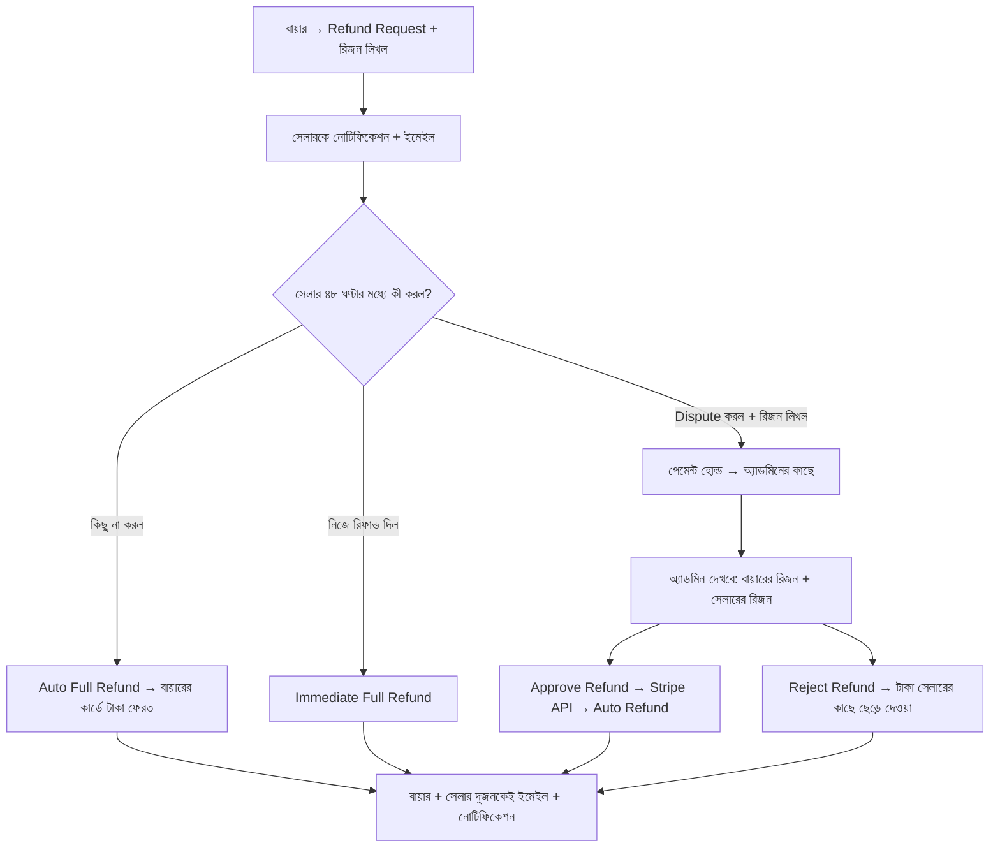

# **📘 Product Requirements Document (PRD)

Payment Management, Refunds & Discounts – Dreamcrowd**

## **🔖 Version:** v1.0

## **👤 Stakeholder:** Dreamcrowd

## **📅 Date:** Latest Meeting Summary

---

# **1. Project Overview**

Dreamcrowd প্ল্যাটফর্মে Stripe–এর মাধ্যমে সম্পূর্ণ অটোমেটেড Payment, Payout এবং Refund সিস্টেম তৈরি করতে হবে।
লক্ষ্য হচ্ছে:

* পেমেন্ট প্রসেস অটোমেট করা
* সেলার পেআউট অটোমেট করা
* সম্পূর্ণ অটো-রিফান্ড + ডিসপিউট + অ্যাডমিন রিভিউ সিস্টেম
* ডিসকাউন্ট কোড তৈরি ও অ্যাডমিন কমিশন থেকে কাটা
* ইনভয়েস জেনারেশন

---

# **2. Objectives**

* Stripe Connect সহ ফুল পেমেন্ট ইন্টিগ্রেশন
* এক ক্লিকে Stripe Refund (অ্যাডমিন প্যানেল থেকে)
* Buyer–Seller ডিসপিউট হ্যান্ডেলিং
* ৪৮ ঘণ্টার অটোমেটেড রিফান্ড রুল
* রিপোর্টিং + ইনভয়েস PDF
* কুপন সিস্টেম (অ্যাডমিন কমিশন থেকে ডিসকাউন্ট)

---

# **3. Core Features**

---

# **3.1 Payment Flow (Stripe Integration)**

### **3.1.1 বর্তমান অবস্থা**

* এখন কোনো পেমেন্ট প্রসেস নেই — শুধু ফর্ম সাবমিট।
* Stripe Connect + Card Payments + Refund API সম্পূর্ণভাবে ইন্টিগ্রেট করতে হবে।

### **3.1.2 Required Stripe Features**

* Stripe Connect Standard/Express (Seller Payouts)
* Payment Intents
* Transfer/Payout automation
* Refund API (Full/Partial)

---

# **3.2 Admin Panel – Payment Management**

## **3.2.1 All Orders List**

ড্যাশবোর্ডে সব ট্রানজ্যাকশনের রিয়েল-টাইম লিস্ট।

### Fields:

* Order ID
* Buyer Name
* Seller Name
* Service Type (Class / Freelance / Video Course)
* Service Title
* Amount
* Discount (if any)
* Admin Commission
* Seller Earnings
* Status:

  * Pending
  * Active
  * Completed
  * Cancelled
  * Refund Requested
  * Disputed
  * Refunded

### Actions:

* View Order Details
* Download Invoice

---

# **3.2.2 Payout Details (Seller Payout Automation)**

### Fields:

* Seller Name
* Total Completed Orders
* Earnings
* Cancelled Orders
* Payout Method: Stripe/PayPal (Primary: Stripe)
* Next Scheduled Payout

### Logic:

* Stripe Connect দিয়ে সেলারদের payout **অটোমেটিক** পাঠানো হবে।
* অ্যাডমিন কোন ম্যানুয়াল স্টেপ করবে না।
* পেআউট ফ্রিকোয়েন্সি: Weekly (configurable)

---

# **3.3 Refund System (Main Focus)**

## **3.3.1 Refund Request (Buyer Side)**

### Buyer Can Request Refund If:

1. Service start time > 12 hours
   → Full refund allowed
2. Service start time < 12 hours
   → Refund NOT allowed
3. Delivered service but unsatisfied
   → Refund allowed (goes through dispute system)

### Buyer Flow:

* Dashboard → Orders → Request Refund
* Must select **Reason (mandatory)**
* Status becomes: **Refund Requested**
* Seller gets email + in-app notification

---

# **3.3.2 Seller Role (48-Hour Rule)**

Seller has *exactly 48 hours* to respond:

### Seller Options:

1. **Approve Refund**
   → Immediate Stripe auto-refund
2. **Do Nothing**
   → After 48 hours → Auto Full Refund triggered
3. **Dispute Refund**

   * Must enter reason
   * Payment becomes **ON HOLD**
   * Refund request moves to Admin Review

---

# **3.3.3 Admin Review (Dispute Stage)**

Admin Panel → Refunds Section

### Admin Sees:

* Buyer Reason
* Seller Reason (if disputed)
* Service info
* Amount
* Timeline (timestamps)

### Admin Actions:

* **View** → See details
* **Approve Refund**

  * Full or partial
  * Auto-refund via Stripe API
* **Reject Refund**

  * Payment released to seller
  * Seller gets payout on next cycle

### Client Request:

> Approve = instant refund
> Reject = seller keeps earnings
> All from admin panel, NO need to login to Stripe.

---

# **3.3.4 Automatic Rules**

| Scenario                              | Action                      |
| ------------------------------------- | --------------------------- |
| Seller silent for 48 hours            | Auto Full Refund            |
| Buyer cancel >12 hours before session | Auto Refund                 |
| Seller disputes                       | Payment Hold + Admin Review |
| Admin approves                        | Auto Stripe Refund          |
| Admin rejects                         | Seller earnings released    |

---

# **3.4 Refund Automation (Core Technical Requirement)**

### Client Requirement:

> “I need the fastest way possible… I don’t want to login to Stripe every time.”

### Implementation:

* Refund triggered through Stripe API:

  * `stripe.refunds.create({ payment_intent, amount })`
* Support:

  * Full refund
  * Partial refund
* System must handle:

  * Transfer reversal if payout has already been initiated
  * Refund failure handler (Stripe Webhooks)

---

# **3.5 Invoice Statement (PDF)**

Admin can download invoice for each payment.

### Invoice Must Include:

* Invoice ID
* Buyer Name
* Seller Name
* Service Type
* Service Title
* Date
* Total Amount
* Discount
* Admin Fee
* Seller Earnings
* Payment Status
* Stripe Transaction ID

Format: PDF

---

# **3.6 Discount Code System**

### Admin Can Create Coupons:

* Flat or Percentage
* Apply to:

  * All Sellers
  * Specific Seller (via email)

### RULE:

> Discount amount will reduce **Admin’s 15% commission only**,
> **Seller earnings will remain unchanged**.

### Example:

* Price: $100
* Admin 15% = $15
* Coupon: $10
* New Admin commission = $5
* Seller gets full $85

---

# **4. System Architecture Overview**

### Key Components:

* Stripe Payment Intent Creation
* Transfer to Seller using Stripe Connect
* Refund API & Transfer Reversal Handling
* 48-Hour Scheduler/Background Job
* Notification System (Email + In-App)
* Admin Dashboard (React/Vue)
* Backend APIs (Laravel/Nest/Django)

---

# **5. Notification Requirements**

### Buyer Notifications:

* Refund Request Submitted
* Refund Approved
* Refund Rejected
* Auto-refund after 48 hours
* Refund under review

### Seller Notifications:

* Buyer requested refund
* 48-hour countdown info
* Dispute submitted
* Admin decision

### Admin Notifications:

* New dispute
* Auto-refund triggered
* Refund failed in Stripe

---

# **6. Edge Cases**

1. Seller payout already made → refund requires **transfer reversal**
2. Partial refund causes recalculation of admin commission
3. Failed refund → fallback email alert + manual retry
4. Discount applied + refund → admin commission adjusts accordingly

---

# **7. Deliverables Checklist (Ready for Developers)**

| Module             | Deliverable                             |
| ------------------ | --------------------------------------- |
| Stripe Integration | Payments + Payouts + Refunds + Webhooks |
| Admin Panel        | Orders + Refunds + Payouts + Invoices   |
| Buyer Dashboard    | Request Refund + Cancel Order           |
| Seller Dashboard   | Refund Approval / Dispute               |
| Refund Automation  | 48-hour scheduler + auto-refund         |
| Discounts          | Coupon generation + application         |
| PDF                | Invoice generator                       |

---

# **8. Acceptance Criteria**

### ⭐ Payment System Works End-to-End

### ⭐ Refund can be triggered 100% from Admin Panel

### ⭐ Seller 48-hour rule works automatically

### ⭐ Seller earnings protected from discount codes

### ⭐ All refunds, payouts, disputes visible in Admin Panel

### ⭐ PDFs downloadable

### ⭐ No need to login to Stripe for any operation

---

# Dreamcrowd – Payment Management & Refund System  
**Product Requirements Document (PRD)**  
তারিখ: ২৪ নভেম্বর ২০২৫ (ক্লায়েন্টের মিটিং অনুযায়ী)

### ১. ওভারভিউ & গোল
ক্লায়েন্ট চায় পুরো পেমেন্ট ও রিফান্ড প্রসেস যেন **Fiverr/Upwork-এর মতো স্মুথ ও অটোমেটেড** হয় এবং অ্যাডমিনকে প্রতিবার Stripe-এ লগইন করে ম্যানুয়ালি কিছু করতে না হয়।

### ২. কী কী ফিচার থাকবে

| ফিচার | ডিটেইলস | কার জন্য |
|------|--------|----------|
| All Orders | সব ট্রানজ্যাকশনের রিয়েল-টাইম লিস্ট (Pending, Active, Completed, Cancelled, Refunded) | অ্যাডমিন |
| Payouts | সেলারের আর্নিংস + অটোমেটিক পেআউট (Stripe Connect দিয়ে) | অ্যাডমিন + সেলার |
| Refund Requests | বায়ারের রিফান্ড রিকোয়েস্ট + রিজন | বায়ার |
| 48-Hour Auto Refund Rule | সেলার ৪৮ ঘণ্টা রিঅ্যাক্ট না করলে অটো ফুল রিফান্ড | সিস্টেম |
| Seller Dispute | সেলার ডিসপিউট করলে পেমেন্ট হোল্ড + অ্যাডমিনের কাছে যাবে | সেলার |
| Admin Refund Dashboard | দুই পক্ষের রিজন + View + Approve/Reject | অ্যাডমিন |
| One-Click Refund | Approve ক্লিক করলেই Stripe API দিয়ে অটো রিফান্ড | অ্যাডমিন |
| Invoice PDF | প্রতিটা ট্রানজ্যাকশনের জন্য PDF ডাউনলোড | অ্যাডমিন + বায়ার + সেলার |
| Discount Codes | অ্যাডমিন কুপন ক্রিয়েট করবে, ডিসকাউন্ট শুধু অ্যাডমিনের ১৫% কমিশন থেকে কাটবে | অ্যাডমিন |

### ৩. রিফান্ড ফ্লো (ক্লায়েন্টের ১০০% কথা অনুযায়ী)

diagram image: /home/hiya/nexa-lance/dreamcrowd/dreamcrowd-backend/mermaid-diagram.svg

### ৪. ক্লায়েন্টের সরাসরি চাওয়া (কোটস)

| কথা | ক্লায়েন্টের কোট |
|------|------------------|
| ৪৮ ঘণ্টা রুল | “If the seller does not reply within 48 hours → buyer automatically gets the refund.” |
| ডিসপিউট | “If dispute → payment on hold → admin investigates → approve or reject.” |
| অটোমেশন | “I need the easiest & fastest way… I don’t want to log into Stripe every time.” |
| এক ক্লিকে রিফান্ড | “If I just click approve, it goes to the buyer.” |
| বাটন সাজেশন | “We could have ‘Approve for buyer’, ‘Approve for seller’ buttons.” |

### ৫. টেকনিক্যাল রিকোয়ারমেন্টস (যা করতেই হবে)

1. **Stripe Connect** অবশ্যই ইন্টিগ্রেট করতে হবে (না হলে অটো পেআউট + রিফান্ড সম্ভব না)  
2. **Webhook** লাগবে:
   - `charge.refunded` → সিস্টেমে রিফান্ড স্ট্যাটাস আপডেট
   - `payout.paid` → সেলারের আর্নিংস আপডেট
3. **Cron Job / Background Job** → প্রতি ঘণ্টায় চেক করবে ৪৮ ঘণ্টা পার হয়েছে কিনা → অটো রিফান্ড
4. **Partial Refund** সাপোর্ট (অ্যাডমিন চাইলে ৫০% রিফান্ড দিতে পারবে)
5. সব স্টেপে **ইমেইল + পুশ নোটিফিকেশন** (ক্লায়েন্ট বারবার বলেছে Fiverr-এর মতো)

### ৬. প্রায়োরিটি (ক্লায়েন্টের কথা অনুযায়ী)
1. ৪৮ ঘণ্টার অটো রিফান্ড  
2. অ্যাডমিন প্যানেল থেকে এক ক্লিকে রিফান্ড (Stripe API)  
3. দুই পক্ষের রিজন দেখানো  
4. পেমেন্ট হোল্ড + নোটিফিকেশন  
5. ইনভয়েস PDF
